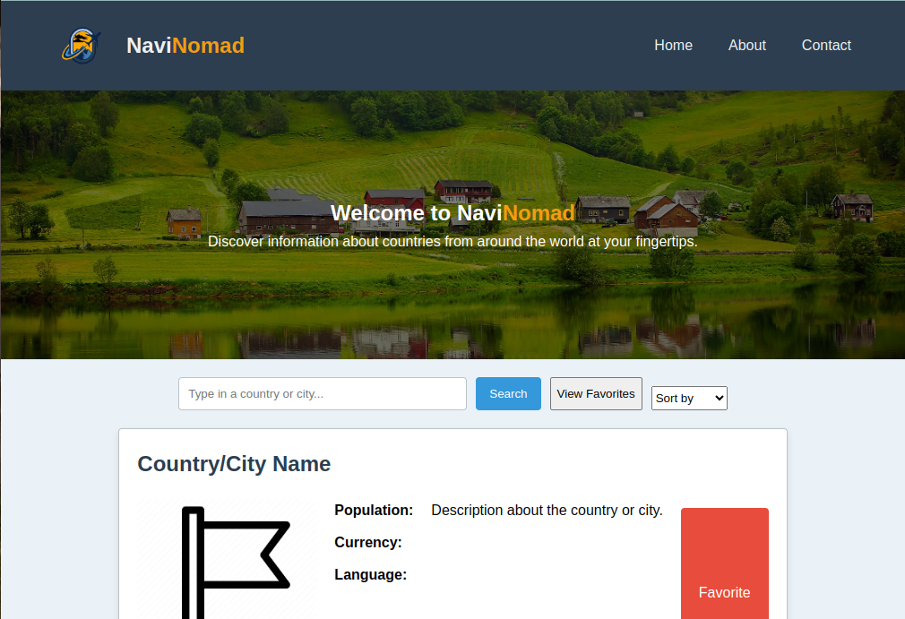

# NaviNomad Explorer 🌍
NaviNomad Explorer is a web application that allows users to search and discover information about countries from around the world. With a simple and intuitive interface, users can quickly find details such as population, currency, languages, and more. Additionally, users can mark their favorite countries for easy access in the future.

**Check Out the Site:** https://travel-destination-explorer.vercel.app/

# Features 🚀

- **Instant Search**: No more waiting. Get instant results as you type.
- **Comprehensive Data**: Dive deep into country specifics - from history snippets to geographical details.
- **Favorites at a Glance**: With a single click, bookmark your dream destinations.
- **Universal Access**: Whether you're on a desktop in New York or a mobile in Tokyo, NaviNomad has got you covered.

# Getting Started
### Prerequisites
A modern web browser (e.g., Chrome, Firefox, Safari, Edge).
### Installation
Clone the repository:

git clone https://github.com/suleosmann/travel-Destination-explorer.git
Navigate to the project directory:

cd travel-Destination-explorer
Open index.html in your preferred web browser.
# User Guide 📘

1. **Start Your Journey**: Simply type the name of your desired country in the search bar.
2. **Deep Dive**: Click on any country to unveil a treasure trove of information.
3. **Bookmarking Memories**: Loved a country? Click on the heart icon to add it to your favorites.
4. **Revisiting Memories**: Access your favorites anytime from the main menu.

### Technologies Used
HTML: For structuring the web content.
CSS: For styling and responsive design.
JavaScript: For interactivity and fetching data from the RestCountries API.
  

### License
This project is licensed under the MIT License. See the LICENSE.md file for details.

### Acknowledgments
Thanks to RestCountries for providing the API.
Inspired by the desire to make country information accessible to everyone.